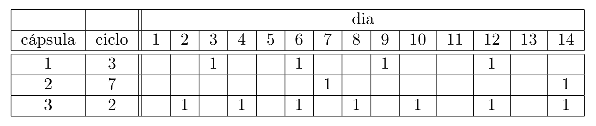

# Cápsulas

O discípulo Fan Chi'ih retornou recentemente da China com algumas cápsulas mágicas, que são capazes de produzir moedas de ouro! Uma cápsula possui um certo ciclo de produção, que é um número C de dias. A cada C dias a cápsula produz uma nova moeda; a moeda é sempre produzida no último dia do ciclo. Fan Chi'ih vai ativar todas as cápsulas ao mesmo tempo e quer acumular uma fortuna de pelo menos F moedas. Ele precisa da sua ajuda para computar o número mínimo de dias para que as cápsulas produzam, no total, pelo menos F moedas. Na tabela abaixo, por exemplo, existem três cápsulas com ciclos de 3, 7 e 2 dias. Se Fan Chi'ih quiser acumular pelo menos 12 moedas, ele vai ter que esperar pelo menos 14 dias.



## Entrada

A primeira linha da entrada contém dois inteiros N e F, indicando o número de cápsulas e o número de moedas que Fan Chi'ih quer produzir, respectivamente. A segunda linha contém N inteiros Ci, para 1 ≤ i ≤ N, representando os ciclos de cada cápsula.

## Saída

Imprima um inteiro, representando o número mínimo de dias para que as cápsulas produzam, no total, pelo menos F moedas.

## Restrições

* 1 ≤ N ≤ 105; 1 ≤ F ≤ 109
* 1 ≤ Ci ≤ 106
* Em todos os casos de teste, a resposta é sempre menor ou igual a 108 dias;
* Em todos os casos de teste, o número de moedas produzido, no total, após 108 dias, é sempre menor ou igual a 109.

# Informações sobre a pontuação

* Para um conjunto de casos de testes valendo 10 pontos, os ciclos Ci são todos iguais (ou seja Ci = Cj para todo 1 ≤ i ≤ N e 1 ≤ j ≤ N).
* Para um conjunto de casos de testes valendo 20 pontos, N ≤ 103, F ≤ 103 e Ci ≤ 103.

## Exemplos

```
Entrada | Saída
--------+-------
3 12    | 14
3 7 2   |
```

```
Entrada                       | Saída
------------------------------+--------
10 100                        | 130
17 13 20 10 12 16 10 13 13 10 |	
```

https://olimpiada.ic.unicamp.br/pratique/pj/2018/f2/capsulas/